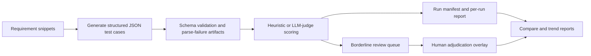

# AI QA Evaluation Harness


A Python evaluation harness that measures whether an LLM can turn requirement snippets into useful QA test cases, using schema validation, rubric-based scoring, human review, and repeatable reporting.

The system includes:

- structured test-case generation through Anthropic models
- heuristic scoring and optional LLM-as-judge scoring
- a human review queue for borderline samples
- per-run, compare, and trend reporting
- persisted run manifests, quality gates, and optional charts

The core question this project answers is:

> Is this model and prompt combination reliable enough to assist QA test design, and where does it still require human review?

This is an evaluation problem, not a generation problem. Every run produces auditable artifacts, explicit pass/fail/review outcomes, and experiment history — not a single anecdotal headline score.

## Evaluation Design

- schema-first generation and validation for structured QA artifacts
- rubric-based scoring with weighted dimensions and floor rules
- human-in-the-loop review for borderline cases
- experiment traceability through run IDs, manifests, persisted scorer choice, and quality gates
- side-by-side comparison and trend reporting across prompt or model variants

## What It Accomplishes

| Area | Implemented |
|---|---|
| Generation | Requirement snippet -> structured JSON test cases |
| Validation | Pydantic schema validation plus parse-failure artifacts |
| Evaluation | Four-dimension scoring with `heuristic` and `llm-judge` modes |
| Review | Borderline routing, adjudication records, and report overlays |
| Reporting | Per-run markdown and CSV, compare reports, trend reports, optional PNG charts |
| Traceability | Timestamped run IDs, git metadata, config capture, and quality-gate decisions |

## Quality Signals

| Signal | Status |
|---|---|
| CI | GitHub Actions runs Ruff, tests, and advisory evaluation quality checks |
| Tests | `make test` (`298 passed` in the current tree) |
| Coverage | `make test-cov` prints a local terminal coverage report (`81%` total in the current tree) |
| Linting | `make lint` runs Ruff |
| Eval gate | `scripts/check_quality_gate.py` checks recent run manifests without calling model APIs |

Current evaluation tracks:

| Track | Dataset | Gold | Configs | Purpose |
|---|---|---|---|---|
| Baseline | `mvp_dataset.jsonl` | `gold_test_cases.jsonl` | `configs/run_v1.yaml` | 10-requirement historical baseline artifact committed |
| Prompt comparison | `mvp_dataset_v2.jsonl` | `gold_test_cases_v2.jsonl` | `configs/run_v2_prompt_v1.yaml`, `configs/run_v2_prompt_v2.yaml` | Prompt comparison on the primary working dataset |
| Alternate model path | `mvp_dataset_v2.jsonl` | `gold_test_cases_v2.jsonl` | `configs/run_v3_haiku.yaml` | Second model or prompt comparison path |

## System At A Glance




## See It In 60 Seconds

Install the development dependencies:

```bash
make install
```

Use a virtual environment first if your Python distribution blocks direct `pip install`.

Render the committed `run_v1` report from local artifacts only:

```bash
make demo
```

Run the test suite:

```bash
make test
```

The demo path does not call Anthropic and does not require an API key. Generation runs, full pipeline runs, and `llm-judge` scoring require `ANTHROPIC_API_KEY`.

## Quickstart

Install the project:

```bash
make install          # core + tests
make install-charts   # adds PNG chart output
```

Set `ANTHROPIC_API_KEY` in your shell or a local `.env` file before generation or `llm-judge` runs.

Run the full pipeline:

```bash
harness run --config configs/run_v2_prompt_v2.yaml
```

Useful follow-up commands:

```bash
harness report  --config configs/run_v2_prompt_v2.yaml --run-id <run_id> --charts
harness review  --run-id <run_id>
harness compare --run-a <run_a> --run-b <run_b> --dataset-path data/requirements/mvp_dataset_v2.jsonl --charts
harness trend   --dataset-path data/requirements/mvp_dataset_v2.jsonl --charts
```

The unified CLI is the recommended entry point:

```bash
harness <subcommand>
```

Available subcommands:

- `run`
- `generate`
- `evaluate`
- `report`
- `review`
- `compare`
- `trend`

## How To Explore This Repo

1. Read this README for the project claim, scope, and quickstart.
2. Read [PROJECT.md](PROJECT.md) for the engineering brief and major design choices.
3. Read [docs/architecture.md](docs/architecture.md) for the end-to-end system flow and artifact model.
4. Read [docs/example_report.md](docs/example_report.md) for a complete harness report from the committed historical v1 run.
5. Read [docs/report_examples.md](docs/report_examples.md) for additional output format examples with commentary.
6. Read [docs/dataset_design.md](docs/dataset_design.md) and [docs/review_workflow.md](docs/review_workflow.md) for the dataset and human-review details.
7. Read [docs/history/README.md](docs/history/README.md) only if you want the implementation-history planning documents.

## Audit Trail

Each run writes a full set of inspectable artifacts rather than a single headline number.

- valid generations are written as `{requirement_id}.json`
- parse or schema failures are written as `{requirement_id}.fail.json` and aggregated in `parse_failures.jsonl`
- scored results are persisted in `scored_results.json`
- each run writes a manifest containing model, prompt, dataset, scorer, thresholds, timestamp, git hash, and quality gate
- optional judge-model verdicts are written as `{requirement_id}.judge.json`
- borderline review happens in a separate `data/reviews/{run_id}/` artifact path

That separation is intentional: automated artifacts stay immutable, while human review remains an overlay.

A complete historical example run is committed and inspectable in this repo:

- [`data/generated/run_v1/`](data/generated/run_v1/) — generated test cases and scored results
- [`data/runs/run_v1.json`](data/runs/run_v1.json) — run manifest and source of truth for recorded model, timestamp, and git hash
- [`reports/run_v1_report.md`](reports/run_v1_report.md) — full markdown report

The current configs are the runnable evaluation setup. The committed `run_v1` artifacts remain historical evidence, so the manifest records the model and metadata for that specific run.

## Deliberate Boundaries

The scope is intentionally narrow:

- no UI or dashboard product layer
- no RAG or vector search
- no autonomous agent workflows
- no attempt to treat raw model output as ground truth
- no large-scale distributed evaluation infrastructure

Those are design choices that keep the evaluation problem crisp and inspectable, not missing polish.

## Historical Design Records

The original implementation plans are preserved under [docs/history/README.md](docs/history/README.md). They show how the project was built through staged phases, but they are intentionally out of the main reader path so the primary docs stay focused on current behavior.
