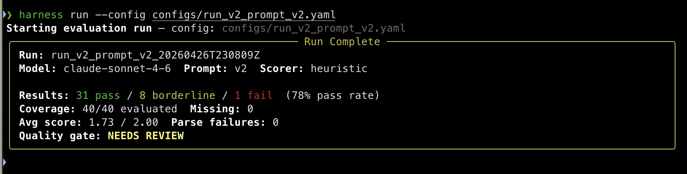
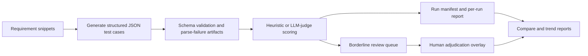

# AI QA Evaluation Harness


A Python evaluation harness for AI-generated QA test cases — schema validation, rubric-based scoring, human-in-the-loop review, and repeatable per-run, compare, and trend reports.

The core question this project answers is:

> Is this model and prompt combination reliable enough to assist QA test design, and where does it still require human review?

This is an evaluation problem, not a generation problem. Every run produces auditable artifacts, explicit pass/fail/review outcomes, and experiment history — not a single anecdotal headline score.

## Real Runs

Two real runs are committed and inspectable — click any cell to land directly in the artifact.

| Run | Model | Prompt | Dataset | Pass | Borderline | Fail | Avg score | Quality gate |
|---|---|---|---|---|---|---|---|---|
| [`run_v1`](data/runs/run_v1.json) | sonnet-4-6 | v1 | 10 items | 8 (80%) | 2 | 0 | 1.85 | PASS |
| [`run_v2_prompt_v2`](data/runs/run_v2_prompt_v2_20260426T230809Z.json) | sonnet-4-6 | v2 | 40 items | 31 (78%) | 8 | 1 | 1.73 | NEEDS REVIEW |



## System At A Glance



## Scoring Rubric

Each generated test case is scored on four dimensions (0–2 scale):

| Dimension | Weight | Floor |
|---|---|---|
| Correctness | 0.35 | ≥ 1 |
| Completeness | 0.30 | ≥ 1 |
| Hallucination risk | 0.20 | ≥ 1 |
| Reviewer usefulness | 0.15 | — |

Decision bands on the weighted average:

- **Pass** — ≥ 1.6 with all floor dimensions met
- **Borderline** — 1.2–1.59 (routed to human review)
- **Fail** — < 1.2, or any floor dimension below threshold

## Capabilities

| Area | Implemented |
|---|---|
| Generation | Requirement snippet -> structured JSON test cases |
| Validation | Pydantic schema validation plus parse-failure artifacts |
| Evaluation | Four-dimension scoring with `heuristic` and `llm-judge` modes |
| Review | Borderline routing, adjudication records, and report overlays |
| Reporting | Per-run markdown and CSV, compare reports, trend reports, optional PNG charts |
| Traceability | Timestamped run IDs, git metadata, config capture, and quality-gate decisions |

## Quality Signals

| Signal | Status |
|---|---|
| CI | GitHub Actions runs Ruff, tests, and advisory evaluation quality checks |
| Tests | `make test` — 324 tests passing |
| Coverage | `make test-cov` — 84% terminal coverage report |
| Linting | `make lint` runs Ruff |
| Eval gate | `scripts/check_quality_gate.py` checks recent run manifests without calling model APIs |

## Quickstart

Requires Python 3.11+. Use a virtual environment if your distribution blocks direct `pip install`.

```bash
make install                                                # core + tests
make demo                                                   # render committed run_v1 report **(no API key)**
export ANTHROPIC_API_KEY="your_api_key_here"                # full pipeline needs a key
harness run --config configs/run_v2_prompt_v2.yaml          # one API call per requirement; ~3–6 min for 40 items
```

For repeat local use, put `ANTHROPIC_API_KEY` in `.env` (already gitignored). Do not commit keys or paste them into reports.

Subcommands: `run | generate | evaluate | report | review | compare | trend`. See [docs/architecture.md](docs/architecture.md) for individual subcommand usage.

## Audit Trail

Each run writes a full set of inspectable artifacts rather than a single headline number.

- valid generations are written as `{requirement_id}.json`
- parse or schema failures are written as `{requirement_id}.fail.json` and aggregated in `parse_failures.jsonl`
- scored results are persisted in `scored_results.json`
- each run writes a manifest containing model, prompt, dataset, scorer, thresholds, timestamp, git hash, and quality gate
- optional judge-model verdicts are written as `{requirement_id}.judge.json`
- borderline review happens in a separate `data/reviews/{run_id}/` artifact path

That separation is intentional: automated artifacts stay immutable, while human review remains an overlay.

| Artifact | run_v1 | run_v2_prompt_v2 |
|---|---|---|
| Generated outputs | [`data/generated/run_v1/`](data/generated/run_v1/) | [`data/generated/run_v2_prompt_v2_.../`](data/generated/run_v2_prompt_v2_20260426T230809Z/) |
| Run manifest | [`data/runs/run_v1.json`](data/runs/run_v1.json) | [`data/runs/run_v2_...json`](data/runs/run_v2_prompt_v2_20260426T230809Z.json) |
| Report | [`reports/run_v1_report.md`](reports/run_v1_report.md) | [`reports/run_v2_..._report.md`](reports/run_v2_prompt_v2_20260426T230809Z_report.md) |
| Scores CSV | [`reports/run_v1_scores.csv`](reports/run_v1_scores.csv) | [`reports/run_v2_..._scores.csv`](reports/run_v2_prompt_v2_20260426T230809Z_scores.csv) |

## Deliberate Boundaries

The scope is intentionally narrow:

- no UI or dashboard product layer
- no RAG or vector search
- no autonomous agent workflows
- no attempt to treat raw model output as ground truth
- no large-scale distributed evaluation infrastructure

Those are design choices that keep the evaluation problem crisp and inspectable, not missing polish.

## Further Reading

1. [PROJECT.md](PROJECT.md) — engineering brief and design choices
2. [docs/architecture.md](docs/architecture.md) — end-to-end flow and artifact model
3. [docs/example_report.md](docs/example_report.md) — full report from the committed v1 run

Implementation history is preserved under [docs/history/](docs/history/README.md).
