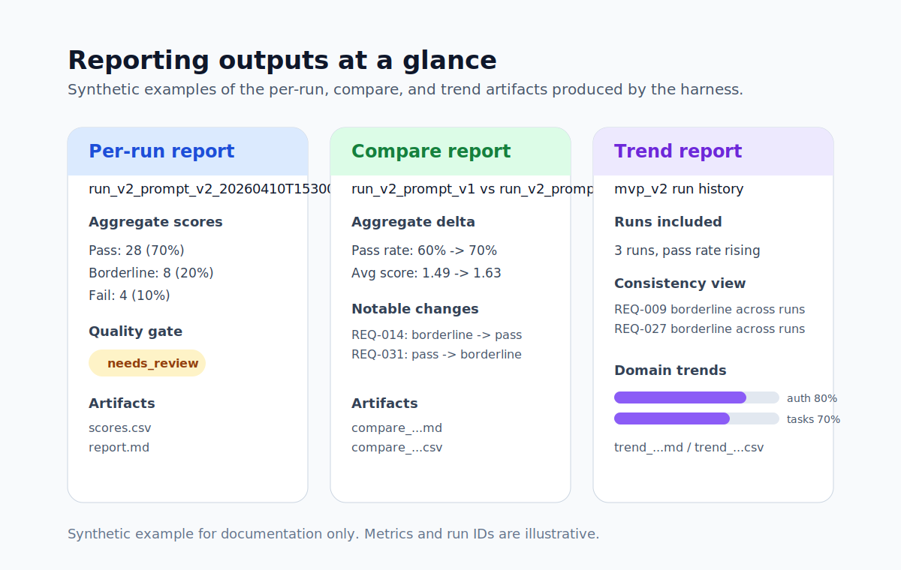

# Report Examples

Related docs: [README](../README.md), [Architecture](architecture.md), [Review Workflow](review_workflow.md)

The per-run example below is synthetic and shows the report structure with commentary. For a complete report from a real pipeline run, see [example_report.md](example_report.md).



## Per-Run Report Example

Example filename:

```text
reports/run_v2_prompt_v2_20260410T153000Z_report.md
reports/run_v2_prompt_v2_20260410T153000Z_scores.csv
```

Example excerpt:

```markdown
# Evaluation Report — run_v2_prompt_v2_20260410T153000Z

## Run Summary

| Field | Value |
|---|---|
| Run ID | `run_v2_prompt_v2_20260410T153000Z` |
| Model | `claude-3-5-sonnet-20241022` |
| Prompt version | `v2` |
| Dataset version | `mvp_v2` |
| Scoring version | `v1` |
| Timestamp | 2026-04-10T15:30:00+00:00 |
| Git commit | `2c0c256` |
| Config | `configs/run_v2_prompt_v2.yaml` |

### Aggregate Scores (Auto)

| Metric | Value |
|---|---|
| Total samples | 40 |
| Pass | 28 (70%) |
| Borderline | 8 (20%) |
| Fail | 4 (10%) |
| Avg weighted score | 1.63 / 2.00 |
| Avg coverage ratio | 74% |
```

What to notice:

- the report keeps run metadata close to the results
- the output answers both “how did it do overall?” and “what needs inspection?”
- the CSV gives a flat, analysis-friendly export while the markdown is reader-facing

## Compare Report Example

Example filename:

```text
reports/compare_run_v2_prompt_v1_20260409T120000Z_vs_run_v2_prompt_v2_20260410T153000Z_<timestamp>.md
```

Example excerpt:

```markdown
## Aggregate Delta

| Metric | Run A | Run B | Delta |
|---|---|---|---|
| Pass rate | 60% | 70% | +0.10 |
| Borderline rate | 25% | 20% | -0.05 |
| Fail rate | 15% | 10% | -0.05 |
| Avg weighted score | 1.49 | 1.63 | +0.14 |

## Notable Changes

- REQ-014: borderline -> pass (1.42 -> 1.68)
- REQ-031: pass -> borderline (1.66 -> 1.54)
```

What to notice:

- comparison is about change, not just static scores
- the report highlights regressions as well as improvements
- dataset consistency is enforced so the delta remains meaningful

## Trend Report Example

Example filename:

```text
reports/trend_<timestamp>.md
reports/trend_<timestamp>.csv
```

Example excerpt:

```markdown
## Runs Included

| Run ID | Model | Prompt | Dataset | Pass% | Avg Score |
|---|---|---|---|---|---|
| run_v2_prompt_v1_20260401T120000Z | claude-3-5-sonnet-20241022 | v1 | mvp_v2 | 58% | 1.47 |
| run_v2_prompt_v2_20260405T120000Z | claude-3-5-sonnet-20241022 | v2 | mvp_v2 | 68% | 1.58 |
| run_v3_haiku_20260410T153000Z | claude-3-5-haiku-20241022 | v3 | mvp_v2 | 70% | 1.61 |

## Consistently Borderline Requirements

- REQ-009
- REQ-027
```

What to notice:

- trend reporting turns one-off runs into a history of evaluation behavior
- “consistently borderline” requirements help distinguish prompt weakness from dataset difficulty
- domain and pass-rate views make the reports more diagnostic than a single average score

## Review Overlay Example

When `--use-human-review` is enabled, reports keep automated artifacts intact and add reviewer context. The per-sample table gains an `Auto Decision` and `Human Decision` column pair:

```markdown
| ID | Auto Decision | Human Decision | Weighted | Correct | Complete | Halluc Risk | Reviewer Use | Coverage | Notes | Diagnostics |
|---|---|---|---|---|---|---|---|---|---|---|
| REQ-017 | ~ borderline | pass | 1.35 | 2.0 | 1.0 | 2.0 | 1.0 | 67% | — | — |
```

What to notice:

- human review is additive, not a rewrite of the auto-scored run
- the repo makes it easy to see where human judgment changed the practical interpretation

## How to Read These Outputs

The reporting layer turns run artifacts into decision-support outputs. Across the three report types, the harness:

- preserves experiment history in a comparable, machine-readable form
- surfaces regressions and improvements when prompts or models change
- exposes persistent uncertainty rather than forcing a single aggregate conclusion
- produces output a reviewer or teammate can act on directly
